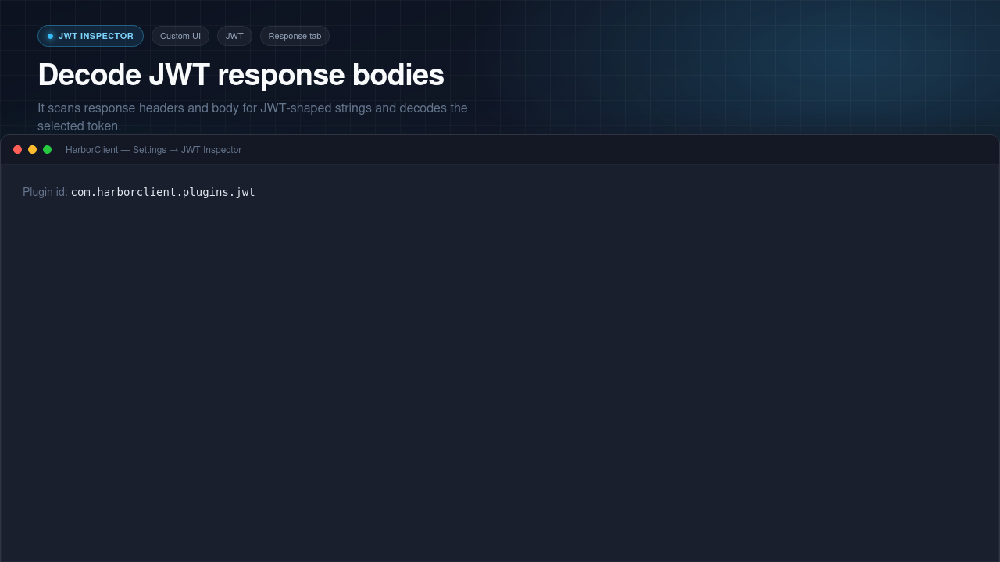

# JWT Inspector

HarborClient plugin that adds a **JWT** tab to the response viewer. It scans response headers and body for JWT-shaped strings, lists every match, and decodes the selected token (base64url header and payload only — no signature verification).




## Development

```bash
pnpm install
pnpm dev
```

In HarborClient: **Settings → Plugins → Load unpacked…** and select this directory.

Optional:

```bash
HARBOR_PLUGINS_DEV=/var/www/harborclient-plugin-jwt pnpm dev
```

(from the HarborClient repo)

## Build

```bash
pnpm build
pnpm pack   # produces jwt.hcp
```

## Tests & quality

```bash
pnpm test
pnpm typecheck
pnpm lint
pnpm format:check
pnpm check:bundle
```
